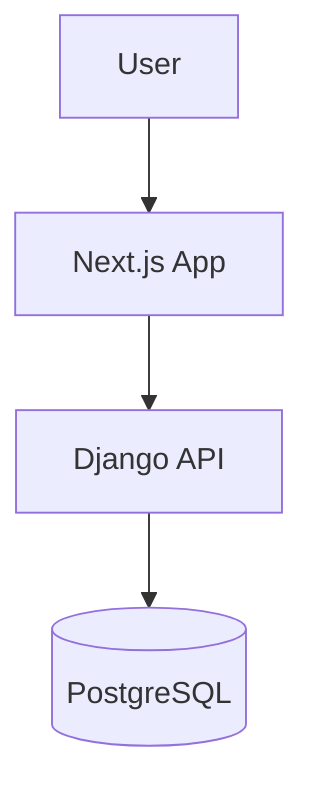

<div align="center">

# HELLDIVERS 2
### COMMUNITY TOOL


<br />

**Complete system for managing Helldivers 2 armor, sets, and passives.**
**Features advanced search, user management, and loadout planning.**

[Getting Started](#-getting-started) • [License](#-license)

</div>

---

## 🏗️ Architecture

This project is composed of a **Next.js** frontend and a **Django** backend.



---

## 🚀 Applications

<div align="center">

| Application | Description | Tech Stack |
|:-----------:|:----------- |:---------- |
| **Frontend** | User interface for armory and loadouts. | `Next.js` `Tailwind` `TypeScript` |
| **Backend** | REST API for game data and user auth. | `Django` `Python` `PostgreSQL` |

</div>

---

## 🛠️ Getting Started

### Prerequisites

*   **Node.js 18+**
*   **Python 3.10+**
*   **PostgreSQL**

### Installation

```bash
# 1. Clone the repository
git clone https://github.com/DionathaGoulart/Helldivers.git

# 2. Setup Backend
cd backend
pip install -r requirements.txt
python manage.py migrate
python manage.py runserver

# 3. Setup Frontend (in a new terminal)
cd ../frontend
npm install
npm run dev
```

---

## 📄 License

This project is proprietary and confidential.

**Copyright © 2026 Dionatha Goulart.**
All Rights Reserved.
