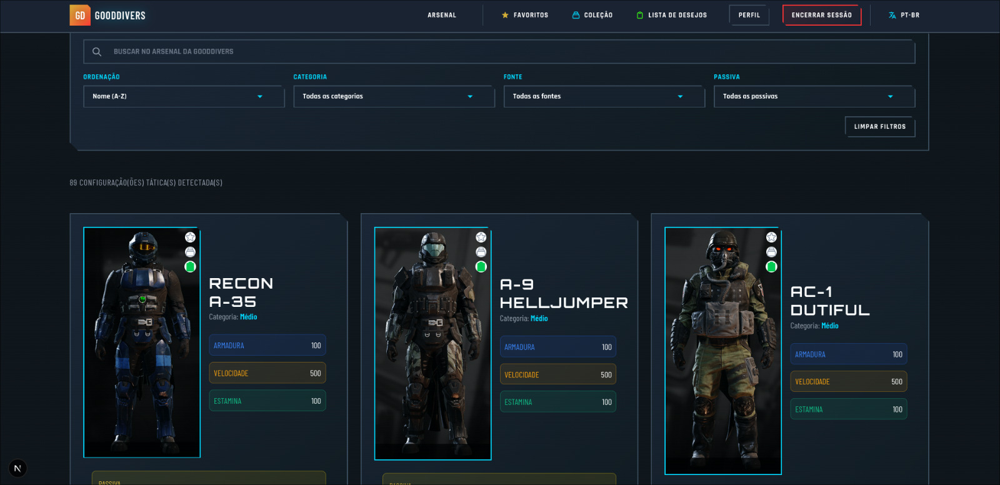

<div align="center">

# 🛡️ Gooddivers Arsenal Frontend

**Frontend completo e moderno para gerenciamento de armaduras do Helldivers 2**

[](https://nextjs.org/)
[](https://reactjs.org/)
[](https://www.typescriptlang.org/)
[](https://tailwindcss.com/)
[](LICENSE)
[](https://netlify.com/)

</div>

---

## 📸 Preview

<div align="center">


<p><em>Preview Home Page</em></p>


<p><em>Preview Aresenal</em></p>

</div>

---

## ✨ Funcionalidades

### 🎯 Principais Características

- 🛡️ **Armory Completo** - Visualize todas as armaduras, capacetes, capas, passivas e sets do jogo com interface moderna
- 🔍 **Busca e Filtros Avançados** - Encontre itens por nome, categoria, fonte, passiva e muito mais
- ⭐ **Sistema de Favoritos** - Marque seus sets favoritos para acesso rápido
- 📦 **Coleção Pessoal** - Organize sua coleção de sets adquiridos
- 💝 **Lista de Desejos** - Mantenha track dos sets que você deseja obter
- 👤 **Perfil de Usuário** - Gerencie seu perfil e preferências
- 🔐 **Autenticação Segura** - Login com email/senha ou Google OAuth
- 🌍 **Suporte Multilíngue** - Interface disponível em Português (PT-BR) e Inglês (EN)

### 🛠️ Funcionalidades Técnicas

- 💾 **Cache Inteligente** - Sistema de cache otimizado com SessionStorage para reduzir requisições
- 🖼️ **Cache de Imagens** - Componente CachedImage com localStorage para carregamento instantâneo
- ⚡ **Performance Otimizada** - Carregamento rápido com cache, lazy loading e code splitting
- 📱 **Totalmente Responsivo** - Interface adaptada para todos os dispositivos (mobile, tablet, desktop)
- 🎨 **Design Temático** - Estética inspirada no universo militar futurista do Helldivers 2
- 🔄 **Atualização Otimista** - UI atualiza instantaneamente antes da confirmação do servidor
- 🎭 **React Compiler** - Otimizações automáticas de renderização com React Compiler
- 🌐 **SSR/SSG** - Server-Side Rendering e Static Site Generation com Next.js App Router
- 🎯 **Type Safety** - TypeScript em todo o projeto para maior segurança de tipos

---

## 🏗️ Arquitetura do Projeto

```
frontend/
├── 📁 app/                      # Next.js App Router
│   ├── (auth)/                  # Rotas de autenticação
│   │   ├── login/               # Página de login
│   │   ├── register/            # Página de registro
│   │   ├── forgot-password/     # Recuperação de senha
│   │   ├── reset-password/       # Reset de senha
│   │   └── confirm-email/       # Confirmação de email
│   ├── armory/                  # Páginas do armory
│   │   ├── sets/                # Lista e detalhes de sets
│   │   ├── armors/              # Lista de armaduras
│   │   ├── helmets/             # Lista de capacetes
│   │   ├── capes/               # Lista de capas
│   │   └── passives/            # Lista de passivas
│   ├── collection/              # Página de coleção
│   ├── favorites/               # Página de favoritos
│   ├── wishlist/                # Página de lista de desejos
│   ├── profile/                 # Página de perfil
│   ├── api/                     # API Routes do Next.js
│   └── layout.tsx               # Layout principal
├── 📁 components/               # Componentes reutilizáveis
│   ├── armory/                 # Componentes específicos do armory
│   │   ├── SetCard.tsx         # Card de set de armadura
│   │   └── PassiveSelect.tsx    # Seletor de passivas
│   ├── layout/                 # Componentes de layout
│   │   ├── Header.tsx          # Cabeçalho da aplicação
│   │   ├── Footer.tsx          # Rodapé
│   │   └── SecurityWarning.tsx # Aviso de segurança
│   └── ui/                     # Componentes de UI base
│       ├── Button.tsx          # Botão customizado
│       ├── Card.tsx            # Card customizado
│       ├── Input.tsx           # Input customizado
│       ├── Select.tsx          # Select customizado
│       ├── CachedImage.tsx     # Imagem com cache
│       └── LoadingSpinner.tsx  # Spinner de loading
├── 📁 contexts/                 # Contexts React
│   ├── AuthContext.tsx         # Context de autenticação
│   └── LanguageContext.tsx     # Context de idioma
├── 📁 hooks/                    # Custom hooks reutilizáveis
│   ├── useAsync.ts             # Hook para operações assíncronas
│   ├── useDebounce.ts          # Hook para debounce
│   ├── useModal.ts             # Hook para modais
│   └── usePasswordStrength.ts  # Hook para validação de senha
├── 📁 lib/                      # Bibliotecas e utilitários
│   ├── api.ts                  # Cliente API (Axios)
│   ├── api-cached.ts           # Funções API com cache
│   ├── auth-cached.ts          # Funções de autenticação com cache
│   ├── armory-cached.ts        # Funções do armory com cache
│   ├── cache.ts                # Sistema de cache (SessionStorage)
│   ├── i18n.ts                 # Utilitários de internacionalização
│   ├── theme.ts                # Configurações de tema
│   ├── error-utils.ts          # Utilitários de erro
│   ├── translations/           # Traduções i18n
│   │   ├── pt-BR.ts            # Português brasileiro
│   │   └── en.ts               # Inglês
│   └── types/                  # Tipos TypeScript
│       ├── armory.ts           # Tipos do armory
│       ├── auth.ts             # Tipos de autenticação
│       └── armory-page.ts      # Tipos das páginas do armory
├── 📁 utils/                    # Funções utilitárias
│   ├── armory.ts               # Utilitários do armory
│   ├── images.ts               # Utilitários de imagens
│   ├── validation.ts           # Validações
│   └── index.ts                # Exportações centralizadas
├── 📁 constants/                # Constantes do projeto
└── 📁 public/                   # Arquivos estáticos

```

---

## 📄 Páginas e Seções

### 🏠 Home

- **Hero Section** - Apresentação inicial com logo e CTA para registro/login
- **Features Cards** - Destaque das principais funcionalidades (Arsenal, Favoritos, Lista de Desejos)
- **Navegação Inteligente** - Botões adaptativos baseados no status de autenticação do usuário

### 🛡️ Armory

- **Página Principal** - Grid de sets com filtros avançados, busca e ordenação
- **Detalhes do Set** - Página completa com informações detalhadas do set (armadura, capacete, capa, passiva)
- **Armaduras** - Lista completa de armaduras individuais com filtros e busca
- **Capacetes** - Lista completa de capacetes com filtros e busca
- **Capas** - Lista completa de capas com filtros e busca
- **Passivas** - Lista completa de passivas disponíveis com descrições traduzidas

### ⭐ Favoritos

- **Meus Favoritos** - Sets marcados como favoritos pelo usuário
- **Ações Rápidas** - Adicionar/remover favoritos diretamente dos cards com atualização otimista

### 📦 Coleção

- **Minha Coleção** - Sets que o usuário possui em sua coleção
- **Organização Visual** - Cards com informações completas de cada set na coleção

### 💝 Lista de Desejos

- **Wishlist** - Sets que o usuário deseja obter
- **Tracking** - Acompanhamento visual de sets desejados

### 👤 Perfil

- **Informações do Usuário** - Visualização e edição de dados pessoais
- **Gerenciamento de Senha** - Troca de senha e recuperação
- **Configurações** - Preferências do usuário e configurações de conta

### 🔐 Autenticação

- **Login** - Autenticação com email/username e senha ou Google OAuth
- **Registro** - Criação de nova conta com validação de senha em tempo real
- **Recuperação de Senha** - Esqueceu senha e reset via email
- **Confirmação de Email** - Verificação de email com token

---

## 🛠️ Tecnologias Utilizadas

### Frontend Principal

- **Next.js 16.0.0** - Framework React com App Router, SSR e SSG
- **React 19.2.0** - Biblioteca JavaScript para interfaces de usuário
- **TypeScript 5.0** - Superset JavaScript com tipagem estática
- **Tailwind CSS 4.0** - Framework CSS utility-first moderno
- **Axios 1.13.0** - Cliente HTTP para chamadas à API

### Ferramentas de Desenvolvimento

- **ESLint 9** - Linter para JavaScript/TypeScript
- **React Compiler 1.0.0** - Otimizações automáticas de renderização
- **Babel Plugin React Compiler** - Compilação do React Compiler
- **npm** - Gerenciador de pacotes Node.js

### Fontes Google

- **Orbitron** - Fonte para títulos (pesos 700, 900)
- **Barlow Condensed** - Fonte principal (pesos 400, 600)
- **Rajdhani** - Fonte para destaques (pesos 500, 700)

### Deploy e CI/CD

- **Netlify** - Plataforma de deploy do frontend (Next.js)
- **Netlify Next.js Plugin** - Plugin oficial para otimização de builds
- **Node.js 20** - Runtime para build e desenvolvimento

### Integrações

- **Google OAuth 2.0** - Autenticação social via Google
- **Cookies HttpOnly** - Tokens JWT armazenados de forma segura

---

## 🚀 Como Executar

### Pré-requisitos

- Node.js 20+
- npm ou yarn
- Backend Django rodando (para API)

### Instalação

```bash
# Clone o repositório
git clone https://github.com/DionathaGoulart/Helldivers.git

# Entre no diretório do frontend
cd Helldivers/frontend

# Instale as dependências
npm install

# Configure as variáveis de ambiente
# Crie um arquivo .env.local na raiz do frontend/
# NEXT_PUBLIC_API_URL=http://localhost:8000
# NEXT_PUBLIC_BASE_URL=http://localhost:3000
# NEXT_PUBLIC_GOOGLE_CLIENT_ID=seu_client_id (opcional)

# Execute em modo desenvolvimento
npm run dev
```

O frontend estará disponível em `http://localhost:3000`

### Scripts Disponíveis

```bash
# Desenvolvimento
npm run dev         # Servidor de desenvolvimento (porta 3000)
npm run build       # Build para produção
npm run start       # Servidor de produção (requer build primeiro)

# Qualidade de Código
npm run lint        # Executa ESLint para verificar código
```

---

## 🧪 CI/CD e Qualidade

### GitHub Actions

O projeto possui workflow automatizado de CI/CD:

- **CI/CD** - Build, testes e deploy automático para Netlify
- **Linting** - Verificação de código com ESLint
- **Type Checking** - Verificação de tipos TypeScript no build

### Ferramentas de Qualidade

- **ESLint** - Linter para código JavaScript/TypeScript com configuração Next.js
- **TypeScript** - Verificação estática de tipos em todo o projeto
- **React Compiler** - Otimizações automáticas de renderização e performance

---

## 🚀 Deploy

### Deploy Automático (Netlify)

O projeto está configurado para deploy automático na Netlify:

- **Produção**: Deploy automático na branch `main`
- **Preview**: Deploy automático em Pull Requests e outras branches
- **URL**: `https://gooddivers.dionatha.com.br`

### Configuração Netlify

- **Framework**: Next.js 16.0.0
- **Runtime**: Node.js 20
- **Build Command**: `npm run build`
- **Output Directory**: `.next`
- **Install Command**: `npm install`

### Configuração Automática

1. Conecte seu repositório no Netlify Dashboard
2. Configure as variáveis de ambiente necessárias
3. O deploy acontece automaticamente via GitHub Actions

### Workflows GitHub Actions

O projeto possui workflow automatizado:

- **CI/CD** (`ci.yml`) - Build, testes e deploy automático

### Deploy Manual

```bash
# Build para produção
npm run build

# Deploy via Netlify CLI
netlify deploy --prod
```

---

## 📊 Performance

- **Cache Inteligente**: Redução de até 95% das requisições HTTP após primeira carga
- **Cache de Imagens**: Imagens armazenadas em localStorage para carregamento instantâneo
- **Lazy Loading**: Componentes e imagens carregados sob demanda
- **Code Splitting**: Divisão automática do código por rotas (Next.js App Router)
- **Otimização de Requisições**: Batching de requisições relacionadas e cache por endpoint
- **TTL Configurável**: Cache com time-to-live ajustável por tipo de dados (SessionStorage)
- **React Compiler**: Otimizações automáticas de renderização e memoização

---

## 🔧 Configuração

### Variáveis de Ambiente

Crie um arquivo `.env.local` na raiz do projeto:

```env
# URL da API Backend
NEXT_PUBLIC_API_URL=http://localhost:8000

# URL Base do Frontend
NEXT_PUBLIC_BASE_URL=http://localhost:3000

# Google OAuth Client ID (opcional)
NEXT_PUBLIC_GOOGLE_CLIENT_ID=seu-google-client-id
```

### Personalização

- **Temas e Cores**: Edite `lib/theme.ts` e componentes de UI em `components/ui/`
- **Traduções**: Adicione novos idiomas em `lib/translations/` e atualize `lib/i18n.ts`
- **Configurações de Cache**: Ajuste TTLs em `lib/cache.ts` (CACHE_TTLS)
- **Fontes**: Configure fontes Google em `app/layout.tsx`
- **Estilos Globais**: Personalize em `app/globals.css`

---

## 📱 Responsividade

O sistema é totalmente responsivo e otimizado para:

- **📱 Mobile** (320px - 768px)
- **📱 Tablet** (768px - 1024px)
- **💻 Desktop** (1024px - 1920px)
- **🖥️ Large Desktop** (1920px+)

---

## ♿ Acessibilidade

- **Navegação por Teclado** - Suporte completo a navegação via teclado
- **ARIA Labels** - Atributos ARIA para leitores de tela
- **Contraste Adequado** - Cores com contraste WCAG AA mínimo
- **Semântica HTML** - Uso correto de elementos semânticos
- **Focus Visible** - Indicação clara de elementos focados

---

## 🌍 Internacionalização

Suporte completo a múltiplos idiomas:

- **🇧🇷 Português (PT-BR)** - Idioma padrão
- **🇺🇸 Inglês (EN)** - Tradução completa
- **Detecção Automática** - Baseada no idioma do navegador
- **Troca Dinâmica** - Alteração de idioma sem recarregar a página
- **Backend i18n** - Mensagens do backend traduzidas dinamicamente via Accept-Language header

---

## 📄 Licença

**MIT License**

Copyright (c) 2025 Dionatha Goulart

Permission is hereby granted, free of charge, to any person obtaining a copy
of this software and associated documentation files (the "Software"), to deal
in the Software without restriction, including without limitation the rights
to use, copy, modify, merge, publish, distribute, sublicense, and/or sell
copies of the Software, and to permit persons to whom the Software is
furnished to do so, subject to the following conditions:

The above copyright notice and this permission notice shall be included in all
copies or substantial portions of the Software.

THE SOFTWARE IS PROVIDED "AS IS", WITHOUT WARRANTY OF ANY KIND, EXPRESS OR
IMPLIED, INCLUDING BUT NOT LIMITED TO THE WARRANTIES OF MERCHANTABILITY,
FITNESS FOR A PARTICULAR PURPOSE AND NONINFRINGEMENT. IN NO EVENT SHALL THE
AUTHORS OR COPYRIGHT HOLDERS BE LIABLE FOR ANY CLAIM, DAMAGES OR OTHER
LIABILITY, WHETHER IN AN ACTION OF CONTRACT, TORT OR OTHERWISE, ARISING FROM,
OUT OF OR IN CONNECTION WITH THE SOFTWARE OR THE USE OR OTHER DEALINGS IN THE
SOFTWARE.

---

## 📚 Documentação Técnica

Documentação técnica detalhada disponível em [`docs/`](./docs/):

- 📖 [README Principal](./docs/README.md) - Índice e visão geral
- 🏗️ [Arquitetura](./docs/ARQUITETURA.md) - Estrutura e padrões
- 💾 [Sistema de Cache](./docs/CACHE.md) - Cache multi-camada
- 🎨 [Componentes](./docs/COMPONENTES.md) - Componentes reutilizáveis
- 🔌 [API e Integração](./docs/API.md) - Backend integration
- 🌍 [Internacionalização](./docs/INTERNACIONALIZACAO.md) - Sistema i18n
- 📝 [Exemplos i18n](./docs/I18N-EXEMPLOS.md) - Exemplos práticos

---

## 📞 Contato

**Desenvolvedor**: Dionatha Goulart  
**Email**: dionatha.work@gmail.com  
**Portfolio**: https://dionatha.com.br/  
**GitHub**: https://github.com/DionathaGoulart  
**Linkedin**: https://www.linkedin.com/in/dionathagoulart/

---

<div align="center">

**Feito by Dionatha Goulart**

</div>

